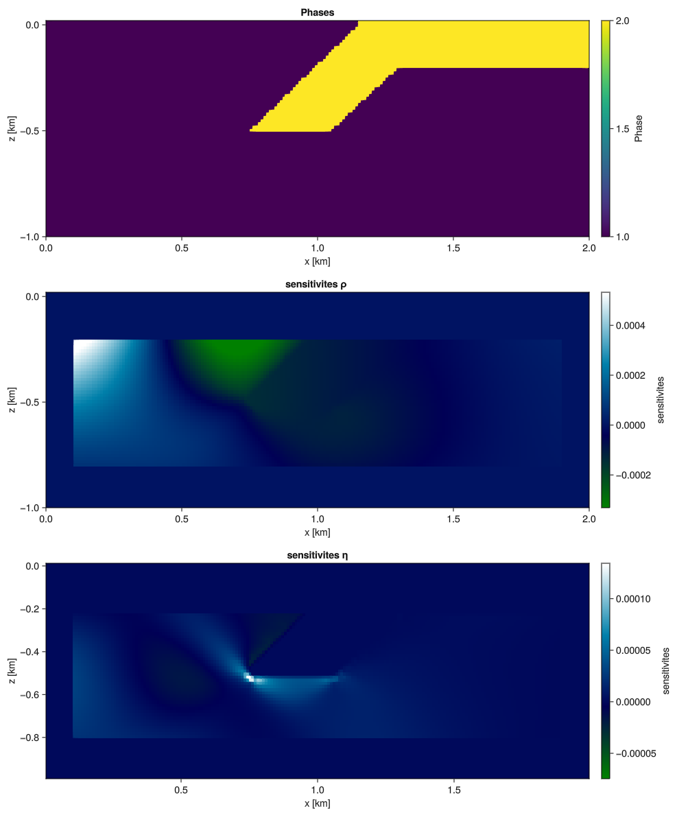

# Julia-User-Group Lunch Seminar 14.12.24

In this lunch-seminar we will be taking a look at how to calculate adjoint sensitivities of physical simulations using ```ForwardDiff.jl```. The main focus will lie on the functionality of the code rather than the derivation of the exact expressions we will use. Additionally, we will take a look at how we can use ```ForwardDiff.jl``` to write flexible codes to simulate partial differential equations. For a detailed introduction on how ```ForwardDiff.jl``` calculates derivatives see the seminars on 31.10. and 14.11.

## Motivation

1) Codes to perform geodynamical simulations have become highly complex and nested as the demand for more realistic physics has increased. As a result, implenting new physics and numerical schemes becomes increasingly difficult with the evolution of such codes. With advancements in **Automatic Differntiation (AD)** we are able to write our codes in a more flexible manner, reducing the number of changes we need to make to adapt or add new new physics.

2) Geodynamic processes are highly complex, non-linear and dependent on many material parameters. Therefore, understanding of the driving forces and important parameters for a given process is very non-intuitive and to make a qualitative statement one must perform many simulations. This is where adjoint-sensitivities save the day! With adjoint sensitivites we can quantify the exact influence of material parameters on simulation results.

#### Goal for today: using the diffusion equation as an example, we will perform forward simulations and determine the sensitivites of the solution on the chosen material parameters.

### Example 1

1D diffusion with Dirichlet boundary conditions


### Example 2

2D diffusion with dirichlet boundary conditions and a source term


## Strategy to Solve Forward Problem

Today we will be solving the temperature diffusion equation using implicit finite-differences. The general formulation of the implicit forward problem is

```math
Ax=b
```

where $A$ is the stiffness-matrix, $x$ the solution vector and $b$ the right hand side vector. In the case that the forward problem is non-linear, we reformulate the last equation into the residual form 

```math
R = Ax - b
```

where $R$ is the vector of residuals. The solution is converged when the $norm(R)$ is smaller than the specified threshold, $\epsilon$. We utilize a linesearch-optimized Newton-solver to solve the system of equations. For completion, here are the sizes of the variables:

Vector $R \in \mathbb{R}^{N}$     |    Matrix $A \in \mathbb{R}^{NxN}$     |    Vector $x \in \mathbb{R}^{N}$   |    Vector $b \in \mathbb{R}^{N}$

The temperature diffusion equation in the strong-form can be written as

```math
{\partial T \over \partial t} = {\partial q\over \partial x} + S
```

where

```math
q = D {\partial T \over \partial x}.
```

Here $x$ is the spatial dimension, $t$ the time dimension, $T$ the temperature, $q$ the temperature flux, $D$ the diffusion coeffiecent and $S$ the source term. Discretizing these equations in the residual form using central finite differences results in the expressions

```math
q_i = D_i {T_{i+{1 \over 2}} ^{n+1} - T_{i-{1 \over 2}} ^{n+1} \over dx}
```

```math
R_i = C_{i} ^{n+1} - C_{i} ^{n} - {\Delta t \over \Delta x ^2}(D_{i+{1 \over 2}}q_{i+{1 \over 2}} - D_{i-{1 \over 2}}q_{i-{1 \over 2}} - S)
```

where n denotes the temporal coordinates and i the spatial coordinates. Note that we deploy a staggered grid, where the temperatures lie in the cell centers and the fluxes on the cell vertices. The 2D case looks as follows:

The staggered grid: 

            + - - - + - - - + - - - + - - - + - - - + - - - +
            |       |       |       |       |       |       |
            |   •   →   •   →   •   →   •   →   •   →   •   |
            |       |       |       |       |       |       |
            + - ↑ - + - ↑ - + - ↑ - + - ↑ - + - ↑ - + - ↑ - +
            |       |       |       |       |       |       |
            |   •   →   •   →   •   →   •   →   •   →   •   |
            |       |       |       |       |       |       |
            + - ↑ - + - ↑ - + - ↑ - + - ↑ - + - ↑ - + - ↑ - +
            |       |       |       |       |       |       |
            |   •   →   •   →   •   →   •   →   •   →   •   |
            |       |       |       |       |       |       |
            + - - - + - - - + - - - + - - - + - - - + - - - +

The temperature, $T$, is saved at "•", therefore the size is (nx, nz)
The horizontal fluxes, $qx$, are saved at "→", therefore the size is (nx-1, nz).
The vertical fluxes, $qz$, are saved at "↑", therefore the size is (nx, nz-1).

## How do we solve the forward problem using ```ForwardDiff.jl```?

The first ingredient we need is a residual function for ```ForwardDiff.jl``` to differentiate. This function must contain all operations that affect the solution, both regarding the solution variables themselves as well as intermediate variables and parameters. The input we use for the residual functions looks as such

```julia
@views function Res!(
    Fvec::AbstractVector{H},
    U::Vector{<:AbstractArray{H}},
    Δ::NTuple,
    N::NTuple,
    BC::NamedTuple,
    Params::NamedTuple,
    Δt,
) where {H<:Number}
```

```ForwardDiff.jl``` needs the arguments that are being used to calculate the jacobian as type ```AbstractVector{Float64}```, which in our case are the residual vectors ```Fvec``` and ```U```. The other needed variables are passed in as type ```Tuple``` or ```Number```:
- ```Δ``` contains the grid spacing
- ```N``` contains the dimensions of all solution variables
- ```BC``` contains the boundary condition values
- ```Params``` contains all of the needed parameters needed in the equations such material parameters and old solution variables. This can be seen as our passing channel from the scopes of the different functions.

Inside the function:

1. unpack our input from type ```Vector``` and ```Tuple```

```julia
    dx, dz = Δ      # grid spacing
    T      = U[1]   # extract 2D fields
    nx, nz = N[1]   # grid size
```

2. Compute new heat fluxes

**IMPORTANT**: when the ```Res!``` function is called by ```ForwardDiff.jl```, the solution vector(s), in this case $T$, will be of type ```DualNumber```, therefore we need to define the calculations where $T$ is needed as DualNumber as well.

```julia
    # compute heat flux
    # in x-direction
    qDx = zeros(eltype(T), (nx-1, nz))
    qDx .= - lin_int(Params.D, 1) .* diff(T, dims=1) ./ dx

    # in z-direction
    qDz = zeros(eltype(T), (nx, nz-1))
    qDz .= - lin_int(Params.D, 2) .* diff(T, dims=2) ./ dz
```

Note that we need to interpolate the diffusion coefficient from the cell centers to the vertices.

3. Compute the residuals

```julia
    # compute residual
    F_T = zeros(eltype(T), (nx, nz))
    F_T[2:end-1, 2:end-1] .= (T[2:end-1,2:end-1] .- Params.T_old[2:end-1,2:end-1]) ...
    .+ Δt .* (diff(qDx[:,2:end-1], dims=1) ./ dx .+ diff(qDz[2:end-1,:], dims=2) ./ dz ...
    .- Params.S[2:end-1,2:end-1])
```

4. Apply the boundary conditions

```julia
    # boundary conditions
    F_T[end,:] .= T[end,:]  .- BC.BC_right
    F_T[:,end] .= T[:,end]  .- BC.BC_top
    F_T[:,  1] .= T[:,  1]  .- BC.BC_bottom
    F_T[1,  :] .= T[1,  :]  .- BC.BC_left
```

5. In the case that we are calculating the residual and not the derivatives, we can store other Arrays we would like visualize in ```Params::Tuple```.
    
```julia
    if eltype(T) == Float64
        # store stuff for visualisation
        Params.qDx .= qDx
        Params.qDz .= qDz
    end
```

6. Update the Vector of residuals

```julia
    Fvec .= [F_T[:];]
```

As mentioned above, ```ForwardDiff.jl``` needs type of Vector{Float64} as an input, but currently we're passing a Vector{<:AbstractArray{H}}. The reason for doing so is that in the case one has more than one solution field, say $Vx$, $Vz$ and $P$ in 2D-Stokes, the fields can be extracted easily despite having different sizes. Therefore we utilize miltiple dispatch to define another $Res!$ function that takes ```U::Vector{Float64}``` 

```julia
function Res!(
    Fup::AbstractVector{H}, up::AbstractVector{H}, Δ, N, BC, Params, Δt
) where {H<:Number}
    return Res!(Fup, vec_2_vecarray(up, N), Δ, N, BC, Params, Δt)
end
```

In addition, the function ```ForwardDiff.jacobian(f!, y::AbstractArray, x::AbstractArray)```  expects only three arguments, therefore we wrap the second ```Res!``` function to only take two arguments. We define this function inside the function ```main()```, the same scope as the variables it is a function of to avoid global variables.

```julia
function main(max_timesteps=2, adj_IDX=2; Δt = nothing, tmax=500000, verbose=true, maxit=1000, Jac = nothing, colors = nothing)
    
    function Res_closed!(F,U)
        Res!(F, U, Δ, N, BC, Params, Δt)
    end
```

Next, we define our physical domain

```julia
    # Domain
    nx = 100
    nz = 100
    lx = 1.0
    lz = 1.0
    x = range(-lx / 2, lx / 2, nx + 1)
    xc = (x[2:end] .+ x[1:(end - 1)]) / 2
    z = range(-lz / 2, lz / 2, nz + 1)
    zc = (z[2:end] .+ z[1:(end - 1)]) / 2
    dx = lx / (nx - 1)
    dz = lz / (nz - 1)
```

and the numerical input for the ```Res!``` function.

```julia
    # Numerics
    N  = ((nx,nz),) 
    Δ  = (dx,dz)
```

We then initialize the ```Arrays``` we'll be needing

```julia
    # initialize solution field
    T    = ones(nx, nz)

    # initialize source term
    Radc = xc.^2 .+ zc'.^2
    S    = ones(nx, nz)
    S[Radc .< 0.005] .= 1.0

    # initialize helper fields
    T_old = copy(T)
    qDx = zeros(nx-1, nz)
    qDz = zeros(nx, nz-1)
    
    # initialize material parameters
    D = ones(nx, nz) .* 1e0
```

as well as the rest of the input for the ```Res!```function.

```julia
    # initialize the Arrays and Tuples that will be passed to the residual function
    Params  = (; T, T_old, S, qDx, qDz, xc, x, zc, z, D, Radc)
    BC      = (; BC_left = 1.0, BC_right = 1.0, BC_top = 1.0, BC_bottom = 1.0)
    U       = [T]
    F       = vecarray_2_vec(U)
```

We then calculate the residual for ay the first time by calling ```Res_closed!```

```julia
    # initialize residual
    Res_closed!(F, U)
```

Next we calculate the jacobian for the first time.

```julia
    if isnothing(Jac)
        println("--------------------------------\nCalculating the Jacobian matrix...\n")

        # Estimate the sparsity pattern using a brute force approach
        Uvec        =   vecarray_2_vec(U)
        J2          =   ForwardDiff.jacobian(Res_closed!, F, Uvec); # slow and non-sparse jacobian; only needs to be done once
        Jac         =   sparse(Float64.(abs.(J2).>0))
        colors      =   matrix_colors(Jac) 

        println("--------------------------------\nJacobian matrix calculated.\n")
    end
```

To do so we transform the ```U::Vector{AbstractArray{Float64}}``` to ```Uvec::U::AbstractVector{Float64}``` for the ```ForwardDiff.jacobian(Res_closed!, F, Uvec)```function. The first time we calculate the jacobian we have no information of the coloring of the jacobian, therefore it is relatively slow. In the next step we determine the sparsity pattern of the jacobian and use it to determine the coloing. This is the most time intensive part of the forward problem and the achilles heel of this method, due to its poor scaling. The reason we do so is to reduce the computation time during the non-linear solver, by reducing the number of iterations needed calculate the jacobian. In the case that sparsity pattern of the jacobian doesn't change during the simulation, the colors will remain the same.

The final part step is to enter the time-stepping loop, which is outsourced in the seperate function

```julia
    time_vec, U = perform_timestepping(
        Params, 
        U, 
        F, 
        Jac, 
        colors, 
        Δt, 
        Res_closed!, 
        N;
        tmax=tmax,
        max_timesteps=max_timesteps,
        verbose=verbose,
        maxit=maxit,
    )
```

which, besides entering the Newton-solver, mainly takes care of plotting routines and updating old variables.

## Solving the adjoint problem

If we have a forward simulation problem that can be described by a linear system of equations of the form:

```math
R = Ax - b
```

then we can solve for $x$ using common algorithms (such as we have don above). If we plug the solution vector $x$ into a scalar valued loss function $F(x, x_{obs})$, we can see the comparison to refernce or target values, such as real world observations. We know that our system/simulation, in other words stiffness matrix $A$ and rhs $b$, depend on some parameters, gathered in the parameter vector $p$.

```math
R = A(p)x(p) - b(p)
```

Our goal is now to find out how our loss function changes when we change a parameter of $p$. So in other words we are interested in calculating 

```math
{dF \over dp}.
```

We can formulate this explicitly to see all of the partial derivatives:

```math
{dF \over dp}^① = {\partial F \over \partial p}^② + {\partial F \over \partial x}^③{d x \over d p}^④
```
```math
\mathbb{R}^{1xP} | \mathbb{R}^{1xP} | \mathbb{R}^{1xN} | \mathbb{R}^{NxP}
```

Of the 4 variables we need, ${d x \over d p}$ will be the most difficult to derive, because the relationships are implicitly given, so unfortunately no direct automatic differntiation. Therefore we want to find an expression for ${d x \over d p}$ by implicitly deriving from the original system of equations.

We can differentiate our initial residual expression

```math
R = Ax - b
```

If we differentiate $R$ with regards to $p$ we get the analogue formulation of the cost function

```math
{dR \over dp} = {\partial R \over \partial p} + {\partial R \over \partial x}{d x \over d p}
```
Just like with the first expression, we now have a method to generate an expression for $dx \over dp$ to insert into the expression of $dF \over dp$. Before we do so, we can make some simplifications:

1) in the case that we don't use a regularization term in the cost function $F$, there is no direct dependency of $F$ on $p$. Therefore the expression reduces to

```math
{dF \over dp} = 0 + {\partial F \over \partial x} {d x \over d p}
```

2) because there is a physical solution to our problem, even when we perturb our parameters in $p$, the residual with regards to $p$ will always be $0$ (after convergence of the non-linear system of equations when we evaluate the residual), therefore:

```math
{dR \over dp} = 0 = {\partial R \over \partial p} + {\partial R \over \partial x}{d x \over d p}
```

Also, to solve the system of equations we need to calculate the **Jacobian** , $J$, of our residual expression, $\partial R \over \partial x$. This is analogue to the stiffness matrix in the formulation above. We can rearrange the equation for $dx \over dp$:

```math
- {\partial R \over \partial p} = J{d x \over d p}
```

```math
- J ^{-1}{\partial R \over \partial p} = {d x \over d p}
```

Combining these equations we arrive at the formulation:

```math
{dF \over dp} = - {\partial F \over \partial x} J ^{-1}{\partial R \over \partial p}
```

By applying bracketing we can again see a linear system of equations analagous to  "$Ax=b$" which we will solve for $dF \over dp$. Here the adjoint parameter, $\lambda$ is now defined as:

```math
\lambda ^T = - {\partial F \over \partial x} J ^{-1}
```
```math
\lambda ^T J = - {\partial F \over \partial x}
```
```math
(\lambda ^T J)^T = - ({\partial F \over \partial x})^T
```
```math
J ^T \lambda = - ({\partial F \over \partial x})^T
```

### Strategy to Solve for ${dF \over dp}$

1) solve forward problem for $x$, so that $R \approx 0$

```math
R = Ax - b
```
```math
\mathbb{R}^{N} | \mathbb{R}^{NxN} | \mathbb{R}^{N} | \mathbb{R}^{N}
```

2) solve the linear system for the adjoint parameter $\lambda$

```math
J ^T \lambda = - ({\partial F \over \partial x})^T
```
```math
\mathbb{R}^{PxN} | \mathbb{R}^{N} | \mathbb{R}^{N}
```

3) calculate the sensitivities $dF \over d p$

```math
{dF \over dp} = -\lambda ^T {\partial R \over \partial p}
```
```math
\mathbb{R}^{1xP} | \mathbb{R}^{1xN} | \mathbb{R}^{NxP}
```

In this final step we will utilize ```ForwardDiff.jl``` again to calculate the jacobian matrix $\partial R \over \partial p$.

### Sensitivity Kernels

In the case that we are interested in calculating sensitivity kernels of our residual function, we reformulate our objective function as:

```math
F = x.
```

As a result, $\partial F \over \partial x$ becomes a mask of ones and zeros, defining at which observation points we would like to calculate the sensitivity kernels.

## How to calculate the sensitivities using ```ForwardDiff.jl```

Due to the fact that ```ForwardDiff.jl``` needs the input of the residual function to be Vectors, we need to define a new function where the material parameters are passed as a vector.

```julia
@views function Res_adjoint!(
    R_adjoint::AbstractVector{H},
    Params_array::Vector{<:AbstractArray{H}},
    U_Tuple::NamedTuple,
    Δ::NTuple,
    N::NTuple,
    N_params::Tuple,
    BC::NamedTuple,
    Params::NamedTuple,
    Δt::Float64 
) where {H<:Number}
```

This function remains nearly untouched as the main change is the extraction of the field variables and material parameters. 

```julia
    dx, dz = Δ      # grid spacing
    nx, nz = N[1]   # grid size

    T = U_Tuple.U   # extract 2D solution fields
    
    D = Params_array[1]         # extract parameter fields
```

The redefinition then propagates through the rest of the function.

```julia
    # compute heat flux
    # in x-direction
    qDx = zeros(eltype(D), (nx-1, nz))
    qDx .= - lin_int(D, 1) .* diff(T, dims=1) ./ dx

    # in z-direction
    qDz = zeros(eltype(D), (nx, nz-1))
    qDz .= - lin_int(D, 2) .* diff(T, dims=2) ./ dz
    
    # compute residual
    F_T = zeros(eltype(D), (nx, nz))
    F_T[2:end-1, 2:end-1] .= (T[2:end-1,2:end-1] .- Params.T_old[2:end-1,2:end-1]) .+ Δt .* (diff(qDx[:,2:end-1], dims=1) ./ dx .+ diff(qDz[2:end-1,:], dims=2) ./ dz .- Params.S[2:end-1,2:end-1])
    
    # boundary conditions
    F_T[end,:] .= T[end,:]  .- BC.BC_right
    F_T[:,end] .= T[:,end]  .- BC.BC_top
    F_T[:,  1] .= T[:,  1]  .- BC.BC_bottom
    F_T[1,  :] .= T[1,  :]  .- BC.BC_left

    R_adjoint .= [F_T[:];]
```

As in the forward problem, we then utilize multiple dispatch.

```julia
function Res_adjoint!(
    R_adjoint::AbstractVector{H}, Params_up::AbstractVector{H}, U_Tuple, Δ, N, N_params, BC, Params, Δt::Float64 
) where {H<:Number}
    return Res_adjoint!(R_adjoint, vec_2_vecarray(Params_up, N_params), U_Tuple, Δ, N, N_params, BC, Params, Δt::Float64 )
end
```

Now that we have a residual function that can propagate the derivatives of $\partial R \over \partial p$ we define a function to calculate the sensitivites.

```julia

function adjoint_sensitivities(J_forward, U, Δ, N, N_params, BC, Params, Δt; IDX=100, IDX1=nothing)

    println("Computing sensitivities for node(s) $IDX")

    U_Tuple = (U=U[1],)
    Params_array = [Params.D]
    R_adjoint = vecarray_2_vec(U)

    ∇_F = zeros(size(R_adjoint))
    if typeof(IDX) == Int
        ∇_F[IDX] = 1.0  # Sensitivity with respect to the node #
    else
        ∇_F[IDX] .= 1.0  # Sensitivity with respect to the node #
    end

    if IDX1 != nothing
        ∇_F[IDX1] .= 1.0  # Sensitivity with respect to the node #
    end

    # Solve the adjoint problem J^T * lambda = -grad_F
    λ = compute_λ(J_forward, ∇_F)

    # Compute dR/dp (Jacobian of residual w.r.t. parameters)
    J_adjoint = dR_dp(Params_array, U, U_Tuple, Δ, N, N_params, BC, Params, Δt)

    # Compute the sensitivity dF/dp
    sensitivities = -λ' * J_adjoint

    return sensitivities, λ, J_adjoint
end
```

First we define the new input we need for ```Res_adjoint!``` and read the indices at which we would like to calculate the sensitivities. Then we calculate the adjoint variable $\lambda$ using the function

```julia
function compute_λ(J_forward, ∇_F)
    return - J_forward' \ ∇_F
end
```

Then we calculate $\partial d \over \partial p$ 

```julia
function dR_dp(Params_array, U, U_Tuple, Δ, N, N_params, BC, Params, Δt)

    Res_adjoint_closed! = (R_adjoint, Params_up) -> Res_adjoint!(R_adjoint, Params_up, U_Tuple, Δ, N, N_params, BC, Params, Δt)

    Params_up = vecarray_2_vec(Params_array)

    # Ensure R_adjoint is correctly sized based on the forward problem residual
    R_adjoint = similar(vecarray_2_vec(U))
    
    # Calculate the adjoint residual for the given Params_array
    Res_adjoint_closed!(R_adjoint, Params_array)
    
    # Compute the Jacobian of the adjoint residual with respect to the parameters
    J_adjoint = ForwardDiff.jacobian(Res_adjoint_closed!, R_adjoint, Params_up)

    return J_adjoint
end
```

Here we define the wrapper around ```Res_adjoint!```, calculate the residual and pass the vectors to ```ForwardDiff.jacobian``` for the jacobian.

In the final step we calculate the sensitivities by the row-vector-matrix multiplication

```julia
    # Compute the sensitivity dF/dp
    sensitivities = -λ' * J_adjoint
```

In this example we're interested in calculating the sensitivies once the forward problem has reached steady-state, so the ```adjoint_sensitivities``` function is called after the timestepping loop.

## Discussion

### Advantages
- **AD** allows for flexible simulations -> to change the physics you only need to adapt ```Res!```
- Calculating sensitivities can be performed analogously for any forward problem
- Ideal as a testing suite for coupled systems of equations with many consituitive equations where deriving the stiffness matrix by hand is too strenuous
  
### Disadvantages
- Scaling of calculating the sparsity pattern/colors is very inefficient, limited to low resolutions or long waiting times
- redefinition of the residual function to get the sensitivities (perhaps Enzyme can help here)

## Appendix: Application to 2D linear-viscous Stokes

#### Falling Block


#### Subduction


