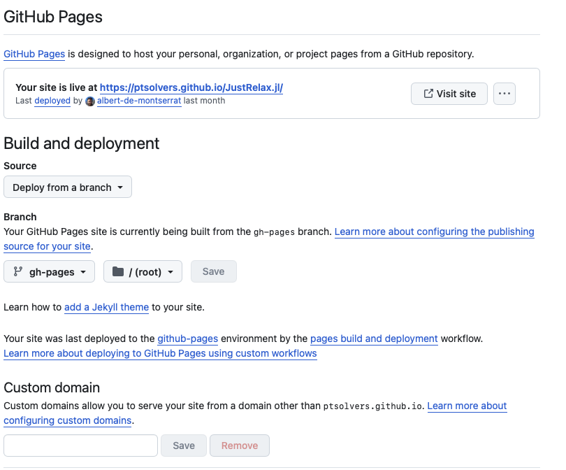

# Leveraging the Julia infrastructure on GitHub for package development
In this short seminar we will discuss how to leverage the Julia infrastructure on GitHub for package development. We will cover the following topics:
- **How to create a new package** ([here](#how-to-create-a-new-package))
- **How to add tests to the package** ([here](#how-to-add-tests-to-the-package))
- **How to add documentation to the package** ([here](#how-to-add-documentation-to-the-package))
- **How to setup a Zenodo repository for the package** ([here](#how-to-setup-a-zenodo-repository-for-the-package))

And most importantly: **How to use the GitHub Actions to automate the testing and documentation of the package**.
Note that this seminar is only a brief introduction to the topic and to best of my knowledge. Here, I want to provide you with some templates you can use in your own packages. In general, the Julia community heavily relies on these things and if you browes GitHub, you will find many examples where you can copy & pasted things to your own package.
A good starting point are: the [SciML organisation](https://github.com/sciml), [Trixi.jl](https://github.com/trixi-framework/Trixi.jl) (developed by Hendrik) or [JustRelax.jl](https://github.com/PTSolvers/JustRelax.jl)

(Julia version 1.11.2 - 09.01.2025)

## How to create a new package

1. Open your Terminal of choice, navigate to the directory where you would like to create the package and type the following command:
```julia-repl
julia> ]
(@v1.11) pkg> generate MyPkg
```
This will create a new directory called `MyPkg` with the following structure:
```
MyPkg/
    Project.toml
    src/
        MyPkg.jl

```

2. Now activate the package environment and add the dependencies you need:
```julia-repl
julia> ]
(@v1.11) pkg> activate MyPkg
(MyPkg) pkg> add OhMyREPL
```
3. You can now add compatibilities of certain packages to the `Project.toml` file.
Julia works with semantic versioning, so you can `$major.$minor.$patch` to specify the version. If you only specify the major version, it will be compatible with all minor and patch versions and so on and so forth.
Let's add the version compatibility for Julia (1.11) and OhMyREPL (5) by typing:
```julia
(MyPkg) pkg> compat
      Compat `~/Documents/PhD/Julia_User_Group_Mainz/2025-01-09_Infrastructure_GitHub_pkg_dev/MyPkg/Project.toml`
  Select an entry to edit:
 >            julia    none
   [5fb14364] OhMyREPL none
   ```

4. Now you can start developing your package. You can add new functions to the `src` directory and test them in the Julia REPL. Important is that you include the functions in the `MyPkg.jl` file and export the function if you'd like to use it outside the source files. This can be done by adding the following line to the `MyPkg.jl` file:
```julia-repl
module MyPkg

include("Example.jl")
export foo

end
```
with foo being a simple function defined in `Example.jl`.
```julia
function foo(x)
    return x^2
end
```

## How to add tests to the package

Once you have defined some functions it is important to test them to ensure they work as intended. Julia provides a testing framework in the `Test` standard library. You can add tests to the `test` directory in the package. The structure of the package should look like this:
```
MyPkg/
    Project.toml
    src/
        MyPkg.jl
        Example.jl
    test/
        Project.toml
        runtests.jl
        test_XXX.jl
```
You can add tests to the runtests.jl file itself or create a new file for each function. For larger packages the latter is recommended.
```julia
using Test
using MyPkg

@testset "MyPkg Tests" begin
    # Example test
    @test foo(2) == 4
    @test foo2(2) == 8
    # Add more tests here
end
```
For larger packages the latter is recommended as it is scalable and you won't lose track of the tests.
The framework for the `runtests.jl` file should look like this:
```julia

function runtests()
    testdir = pwd()
    istest(f) = endswith(f, ".jl") && startswith(basename(f), "test_")
    testfiles = sort(
        filter(
            istest,
            vcat([joinpath.(root, files) for (root, dirs, files) in walkdir(testdir)]...),
        ),
    )
    nfail = 0
    printstyled("Testing package MyPkg.jl\n"; bold=true, color=:white)

    for f in testfiles
        println("")
        println("Running tests from $f")

        try
            run(`$(Base.julia_cmd()) -O3 --startup-file=no --check-bounds=no $(joinpath(testdir, f))`)
        catch ex
            nfail += 1
        end
    end

    return nfail
end

runtests()
```

Now that we have build the testing framework we can run the tests in the Julia REPL by typing:
```julia-repl
julia> ]
(@v1.11) pkg> activate MyPkg
(MyPkg) pkg> test MyPkg
```

This can also be done on GitHub using the GitHub action workflows. There are almost unlimited possibilities to customize the workflows to your needs. For more information on GitHub actions see the [official documentation](https://docs.github.com/en/actions).
The GH Continuous Integration (CI) will automatically run the tests for you and you will be notified if something goes wrong. This is a great way to ensure that your package is working as intended, especially when collaborating with others.

The first thing we need to do is to create a new file in the `.github/workflows` directory. Let's call it `CI.yml`. The structure of the file should look like this:
```yaml
name: CI
on:
  push:
    branches:
      - main
  pull_request:
    branches:
      - main

# Cancel redundant CI tests automatically
concurrency:
  group: ${{ github.workflow }}-${{ github.ref }}
  cancel-in-progress: true

jobs:
  test:
    name: Julia ${{ matrix.version }} - ${{ matrix.os }} - ${{ matrix.arch }} - ${{ github.event_name }}
    runs-on: ${{ matrix.os }}
    strategy:
      fail-fast: false
      matrix:
        version:
          - '1.10'
          - '1.11'
          - 'pre'
          # - 'nightly'
        os:
          - ubuntu-latest
          - macOS-13 # Intel Chip
          - windows-latest
        arch:
          - x64
        include:
          - os: macOS-latest
            arch: aarch64
            version: '1.10'
          - os: macOS-latest
            arch: aarch64
            version: '1.11'
          - os: macOS-latest
            arch: aarch64
            version: 'pre'

    steps:
      - uses: actions/checkout@v4
      - uses: julia-actions/setup-julia@v2
        with:
          version: ${{ matrix.version }}
          arch: ${{ matrix.arch }}
      - uses: actions/cache@v4
        env:
          cache-name: cache-artifacts
        with:
          path: ~/.julia/artifacts
          key: ${{ runner.os }}-test-${{ env.cache-name }}-${{ hashFiles('**/Project.toml') }}
          restore-keys: |
            ${{ runner.os }}-test-${{ env.cache-name }}-
            ${{ runner.os }}-test-
            ${{ runner.os }}-
      - uses: julia-actions/julia-buildpkg@latest
      - uses: julia-actions/julia-runtest@latest
```

The first lines will define where the GH CI will run. Here I set it up to run on every push to the main branch and on every pull request to the main branch. The `concurrency` part will cancel redundant CI tests automatically.


## How to add documentation to the package

Adding documentation to your Julia package is essential for users to understand how to use your package. Julia provides a powerful documentation system through the [Documenter.jl](https://documenter.juliadocs.org/stable/) package. Here is a step-by-step guide on how to add documentation to your package:

1. **Generate a Documentation Directory**:
First, you need to generate a documentation directory for your package. There is already a tool for setting up everything nicely for you. Open your Julia REPL and type the following command:

!!! info "The package `DocumenterTools` is already added to the Project.toml"

```julia-repl
  julia> ]
  (MyPkg) pkg> add DocumenterTools
  julia> using DocumenterTools
  julia> DocumenterTools.generate()
  ```
This will create a new directory called `docs` with the following structure:
   ```
   MyPkg/
       docs/
           make.jl
           Project.toml
           .gitignore
           src/
               index.md
   ```

4. **Setup `docs/make.jl`**:
   Add the following content to `docs/make.jl`:
   ```julia
   using Documenter
   #If your package is not yet installed, you can use this line to load it
   push!(LOAD_PATH,"../src/")
   using MyPkg

   makedocs(
       sitename = "MyPkg Documentation",
       modules = [MyPkg],
       format = Documenter.HTML(),
       pages = [
           "Home" => "index.md",
           "Installation" => "man/installation.md",
           "List of functions" => "man/listfunctions.md",
       ],
   )
   ```
This will generate the documentation for your package using the `Documenter.HTML()` format. You can customize the pages and content as needed. The `man` directory is where you can add additional documentation pages. The `index.md` file must be in the root of the `docs/src` directory and is the main landing page for your documentation.

6. **Generate Documentation**:
   To generate the documentation, run the `make.jl` script:
   ```julia-repl
   julia> include("docs/make.jl")
   ```

7. **Deploy Documentation**:
   You can deploy your documentation using GitHub Pages. Add the following GitHub Actions workflow to `.github/workflows/Documentation.yml`:
```yaml
# Note: this workflow is copied from the Trixi.jl package
name: Documentation
on:
  push:
    branches:
      - 'main'
    tags: '*'
    # paths-ignore:
    #   - add path to files you want to ignore here
    #   - '.github/workflows/SpellCheck.yml'
  pull_request:
    # paths-ignore:
    #   - '.github/workflows/SpellCheck.yml'
    #   - '.github/workflows/UnitTests.yml'
    #   - '.github/workflows/TagBot.yml'
  workflow_dispatch:

# Cancel redundant CI tests automatically
concurrency:
  group: ${{ github.workflow }}-${{ github.ref }}
  cancel-in-progress: true

jobs:
  build:
    permissions:
      contents: write
      pull-requests: read
      statuses: write
    runs-on: ubuntu-latest
    steps:
      - uses: actions/checkout@v4
      - uses: julia-actions/setup-julia@v2
        with:
          version: '1.11'
      - uses: julia-actions/cache@v2
      - uses: julia-actions/julia-buildpkg@latest
      - name: Install dependencies
        run: julia --project=docs/ -e 'using Pkg; Pkg.develop(PackageSpec(path=pwd())); Pkg.instantiate()'
      - name: Build and deploy
        env:
          GITHUB_TOKEN: ${{ secrets.GITHUB_TOKEN }} # If authenticating with GitHub Actions token
          DOCUMENTER_KEY: ${{ secrets.DOCUMENTER_KEY }} # If authenticating with SSH deploy key
        run: julia --project=docs/ docs/make.jl

```
Before you can deploy your documentation, you need to add a GitHub token to your repository. Go to your GitHub repository, click on "Settings", then "Secrets and variables", and add a new secret with the name `DOCUMENTER_KEY` and the value of your GitHub token. This will allow the GitHub Actions workflow to deploy the documentation to GitHub Pages.
The next step is to also setup the GitHub Pages itself. Go to your repository,  in the `Settings/Code and automation/Pages` you can set the source to `gh-pages` and the root to `/(root)`. You can even set your own custom domain if you have one.

When you push to the main branch or create a new tag, the documentation will be automatically built and deployed to GitHub Pages.
By following these steps, you will have a well-documented Julia package that is easy for users to understand and use. For more information, refer to the [Documenter.jl documentation](https://documenter.juliadocs.org/stable/).


## How to setup a Zenodo repository for the package

Zenodo is a research data repository that allows you to archive and share your research outputs, including software packages. By integrating Zenodo with GitHub, you can automatically archive each release of your package. Here is a step-by-step guide on how to set up a Zenodo repository for your package:

1. **Create a Zenodo Account**:
   First, create an account on [Zenodo](https://zenodo.org/). You can sign up using your GitHub account for easier integration.

2. **Link GitHub with Zenodo**:
   After creating your Zenodo account, link it with your GitHub account:
   - Go to your Zenodo dashboard.
   - Click on your profile picture in the top right corner and select "GitHub".
   - Click the "Connect" button to link your GitHub account.

3. **Enable GitHub Repository for Zenodo**:
   - In the Zenodo GitHub tab, you will see a list of your GitHub repositories.
   - Find the repository for your package and toggle the switch to enable it for Zenodo.

4. **Add a Webhook**
    - Go to your GitHub repository.
    - Click on "Settings" in the right sidebar.
    - Click on "Webhooks" and then "Add webhook".
    - Enter the payload URL provided by Zenodo.
    - Select "application/json" as the content type.
    - Click "Add webhook".
*This might not be necessary as the Zenodo integration with GitHub is already quite good.*
5. **Create a GitHub Release**:
   - Go to your GitHub repository.
   - Click on "Releases" in the right sidebar.
   - Click the "Draft a new release" button.
   - Fill in the release details and click "Publish release".

6. **Configure Zenodo Metadata**:
   - After publishing a release, Zenodo will automatically archive it.
   - Go to your Zenodo dashboard and find the archived release.
   - Click on the title to edit the metadata.
   - Fill in the required metadata fields, such as title, authors, description, and keywords.
   - Save the changes.

6. **Add Zenodo Badge to README**:
   To show the Zenodo DOI badge in your README file, add the following Markdown code:
   ```markdown
   [](https://doi.org/YOUR_DOI_HERE)
   ```
   Replace `YOUR_DOI_HERE` with the actual DOI provided by Zenodo for your package.

By following these steps, you will have a Zenodo repository set up for your package, and each GitHub release will be automatically archived. This ensures that your package is properly archived and citable, enhancing its visibility and impact in the research community. For more information, refer to the [Zenodo documentation](https://zenodo.org/).
